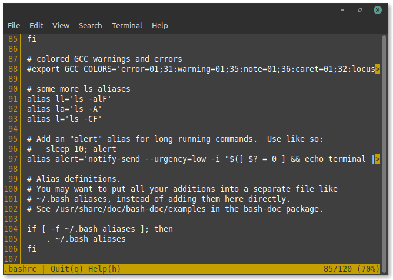
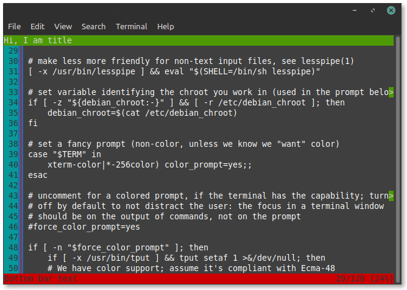

# Welcome to ppager Docs

**ppager** is a pager library that can be implemented to your projects easily.

### Install with pip
~~~
pip install ppager
~~~
[PyPI link](https://pypi.org/project/ppager/)
---
### Default ppager instance:

---

### Customize Examples:

